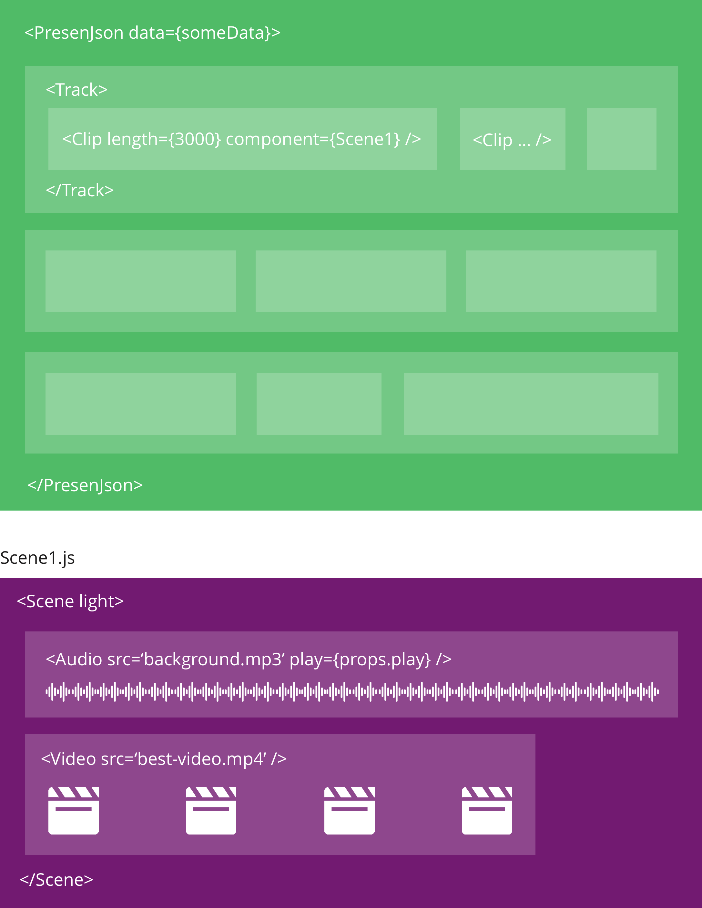

# Presenjson Proof of Concept
### Responsive videos for the web

## TL;DR
With Presenjson you can create interactive and responsive videos and play them on all devices on the web. You control the content of the video by react components and style the video using css.

Think of Presenjson as Adobe Premiere®, where you can put video and audio clips into tracks, maybe add some effects and then probably render it to an .mp4 file at the end. Presenjson basically works the same, except leaves the last step of rendering it to an mp4 file away - the Browser takes over this job and does it on every client. You are defining the 'raw' video with all its assets.


## Motivation
For example - lets say you are trying to build the simplest product to sell a very complicated product - cruises. 

A single cruise has a lot of information  attached to it - the itinerary (which ports when for how long), what the ship has to offer (they are huge, so a lot), what cabins are available and how much they cost. This is a lot of information to get across - especially on mobile. so instead of leaving it up to the cruiser to scroll to death - lets create a short presentation or video that compacts the most useful information into 60 seconds. Now we could always contract an agency to create cute little videos for the top 200 cruises - but if you want to include some volatile information like the current price into it - you will have to keep updating the video with the current price (which can change muliple times a day). Doing this for 15k itenerary combinations just doesn't seem feasable. One way to make this possible is to create a template or skeleton of the video - think of this as a timeline or screenplay of what content is displayed when. In the cruise case - we might decide to spend the first 15 seconds introducing the ship and combine it with the top 3 meaningful user reviews. After that we probably want to give a quick walkthru of the main ports of call followed by the climate of the region. At the end We will show the current price per cabin, or maybe just the price of the selected cabin of interest. Sounds good? Lets start with the basic setup.

### How it works



## Minimum Setup
In the minimum setup we will define a Presentation with one `Clip` to play.

```JavaScript
/* Presentation.js */
import { PresenJson } from 'presenjson';
import Ship from './Ship.js';

const data = {
    ship: {
        picture: 'https://presenjson.com/examples/assets/ship.jpg',
        name: 'The Biggest Ship ever built'
    }
};

const Presentation = () => {
    return (
        <PresenJson data={data} >
            <Track>
                <Clip length={3000} component={Ship}/>
            </Track>
        </PresenJson>
    );
}
```

Each Presenjson can have multiple `Track`s which can contain multiple `Clip`s. The tracks are played at the same time in paralell, the clips are played in sequence. With the `component` prop of `Clip` you define what component should be rendered. The `data` prop of `PresenJson` defines the global data of the  video and is passed down to each `Clip` via `props.data`.

```JavaScript
/* Ship.js */
export default (props) => {
    return (
        <Scene>
            <h1>{props.data.ship.name}</h1>
        </Scene>
    );
}
```

Now if we render `Presentation.js` the result will be a 3 second video showing the ships name.

TODO: insert gif of clicking play and showing image for 3 seconds

We can now also go a step further and add the ship image in the background with the `Image` and `Style` component

```JavaScript
/* ShipName.js */
export default (props) => {
	return (
	    <Scene>
	        <Style fullscreen blur>
	            <Image src={props.data.ship.picture} />
	        </Style>
	        <h1>{props.data.ship.name}</h1>
	    </Scene>
	);
}
```

[GIF] of result

- add animation to first clip
- second clip with video
- add second track with background audio

### Video

### Image

### Audio


### Sequences

### Visual effects (vfx)

## Why

## How

## What Presenjson does
Presenjson takes care of the sceduling - meaning that it decides what component to render at what time. It provides basic audiovisual components like `Audio`, `Video` and `Image`.  `Style` and `Animated`


## Roadmap
- Preload assets (Audio/Video buffers)
- Use Audio Context/Nodes
- Use MSE 
- Jump to any position with correct music/video/animation sync
- Render stuff before actually on screen


## 